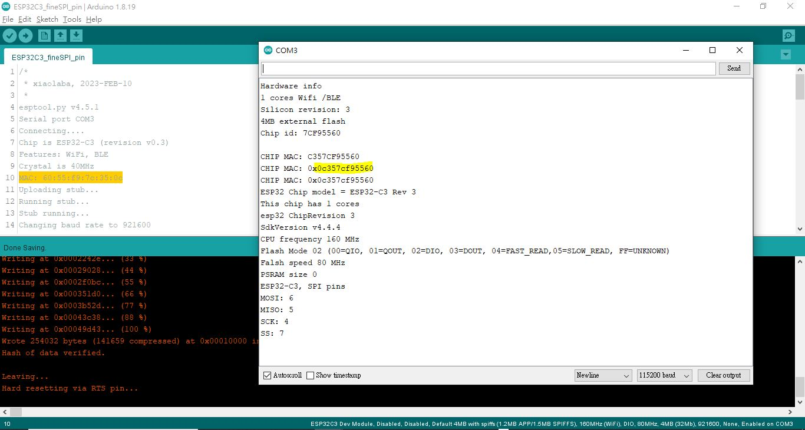

# ESP32_MAC_chip_info
arduino ESP.getxxxx, chip model, MAC, revsion etc.


```
/*
 * xiaolaba, 2023-FEB-10
 * 
esptool.py v4.5.1
Serial port COM3
Connecting....
Chip is ESP32-C3 (revision v0.3)
Features: WiFi, BLE
Crystal is 40MHz
MAC: 60:55:f9:7c:35:0c
Uploading stub...
Running stub...
Stub running...
Changing baud rate to 921600

 */


void setup() {

#if defined(ARDUINO_ARCH_ESP32)
#define MAC_P   (uint64_t) ESP.getEfuseMac()
#endif

#if defined(ARDUINO_ARCH_ESP8266)
#define PROC_ID (uint32_t)ESP.getChipId()
#endif


  Serial.begin(115200);

  esp_chip_info_t chip_info;
  esp_chip_info   (&chip_info);
   
  Serial.println("Hardware info");
  Serial.printf("%d cores Wifi %s%s\n", 
    chip_info.cores, 
    (chip_info.features & CHIP_FEATURE_BT) ? "/BT" : "", 
    (chip_info.features & CHIP_FEATURE_BLE) ? "/BLE" : "");
  Serial.printf("Silicon revision: %d\n", chip_info.revision);
  Serial.printf("%dMB %s flash\n", 
    spi_flash_get_chip_size()/(1024*1024),
    (chip_info.features & CHIP_FEATURE_EMB_FLASH) ? "embeded" : "external");
   
  //get chip id
  String chipId = String((uint32_t)ESP.getEfuseMac(), HEX);
  chipId.toUpperCase();
  Serial.printf("Chip id: %s\n", chipId.c_str());
  
  Serial.print  ("\nCHIP MAC: ");
  Serial.println(MAC_P,HEX);

  // The # part gives you a 0x in the output string. 
  // The 0 and the x count against your "14" characters, include 0x.
  // complete MAC
  Serial.printf("CHIP MAC: %#014llx\n", MAC_P);
  Serial.printf("CHIP MAC: 0x%012llx\n", MAC_P);  // same output as above

  Serial.printf("ESP32 Chip model = %s Rev %d\n", ESP.getChipModel(), ESP.getChipRevision());
  Serial.printf("This chip has %d cores\n", ESP.getChipCores());
  
  Serial.printf("esp32 ChipRevision %d\n", ESP.getChipRevision() );
  Serial.printf("SdkVersion %s\n", ESP.getSdkVersion() );
  Serial.printf("CPU frequency %d MHz\n", ESP.getCpuFreqMHz());
  uint8_t flashchipmode = ESP.getFlashChipMode();
  Serial.printf("Flash Mode %02x (00=QIO, 01=QOUT, 02=DIO, 03=DOUT, 04=FAST_READ,05=SLOW_READ, FF=UNKNOWN)\n", flashchipmode);
  Serial.printf("Falsh speed %d MHz\n", ESP.getFlashChipSpeed()/1000000);
  Serial.printf("PSRAM size %d\n", ESP.getPsramSize());
  
  Serial.println("ESP32-C3, SPI pins");
  Serial.print("MOSI: ");
  Serial.println(MOSI);
  Serial.print("MISO: ");
  Serial.println(MISO);
  Serial.print("SCK: ");
  Serial.println(SCK);
  Serial.print("SS: ");
  Serial.println(SS);  
}

void loop() {
  // put your main code here, to run repeatedly:
}

```


 
